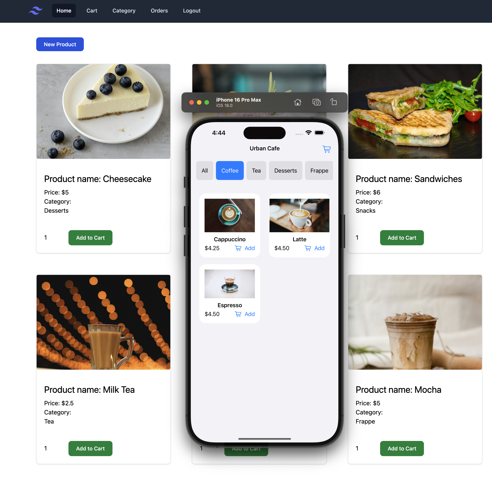
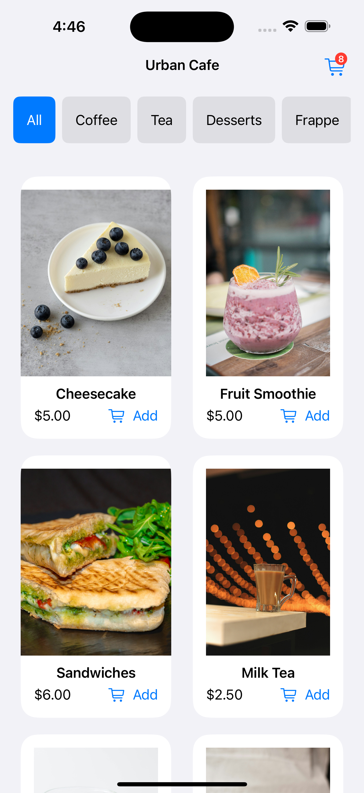
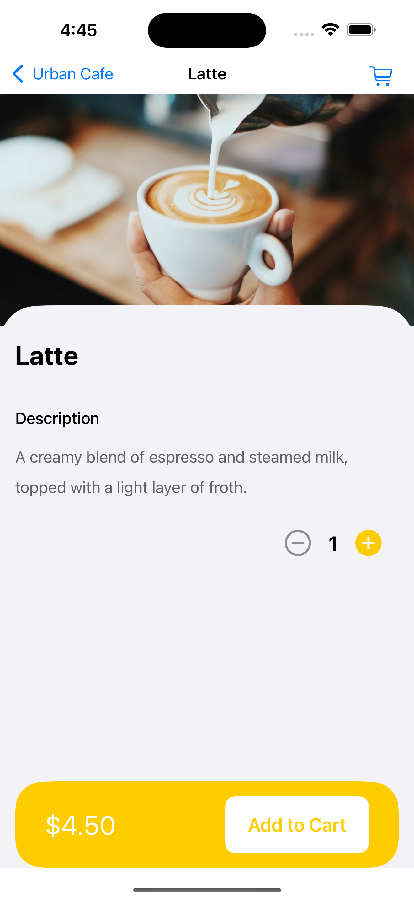
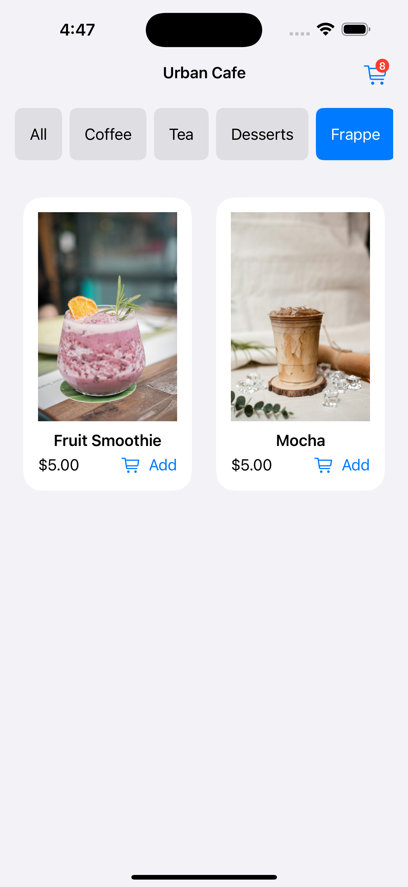
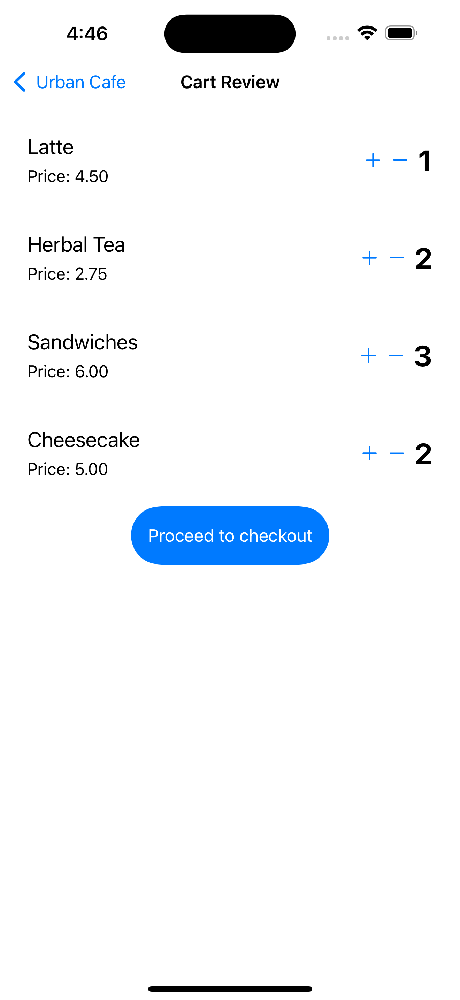

# iOS E-commerce app with Stripe Integration
Complete Caffe app for iOS using SwiftUI. Backend code also added in the repository. Backend developed using Laravel. If you don't understand any code, you can follow this tutorial: [Complete iOS E-Commerce App in SwiftUI with Stripe & Apple Pay Integration](https://devswiftly.com/complete-e-commerce-app-in-swiftui-with-stripe-apple-pay/). Where I have implemented the full process with dummy data. 

### Set Up Stripe API Keys in .env 

Add your Stripe API keys to your .env file:

    STRIPE_SECRET=YOUR_STRIPE_SECREAT
    STRIPE_PUBLISHED=YOUR_STRIPE_PUBLISHED_KEY

